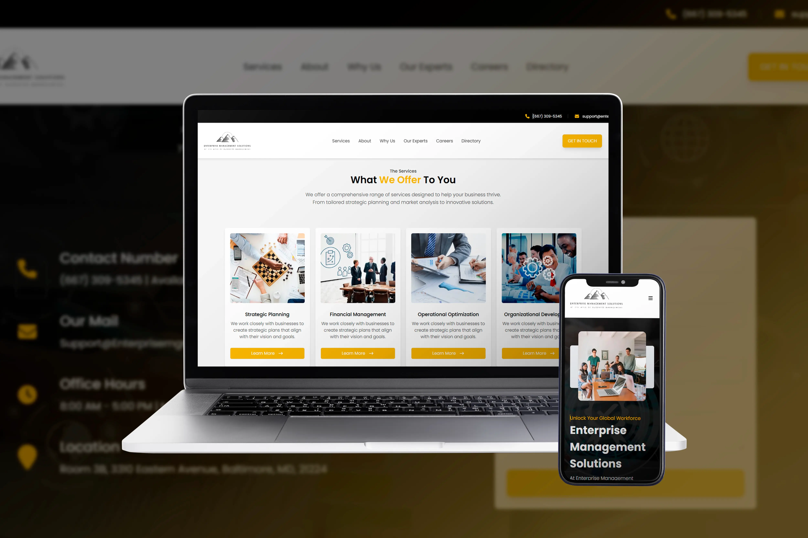
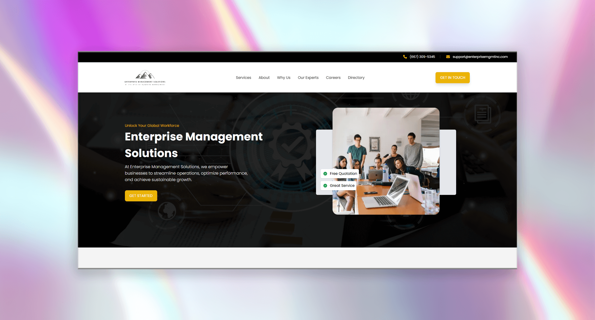
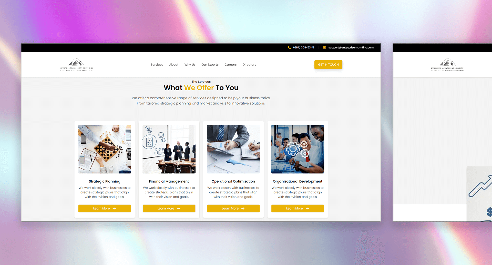
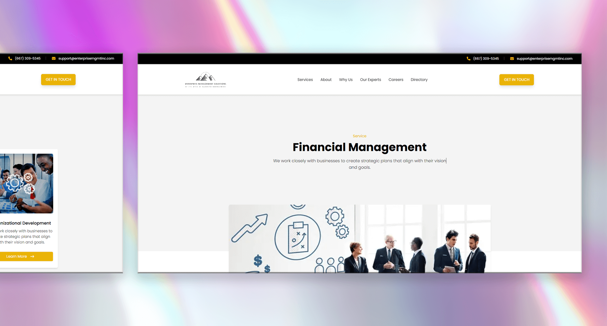
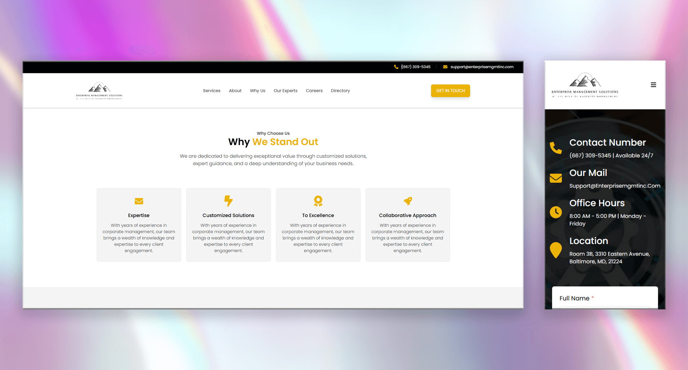
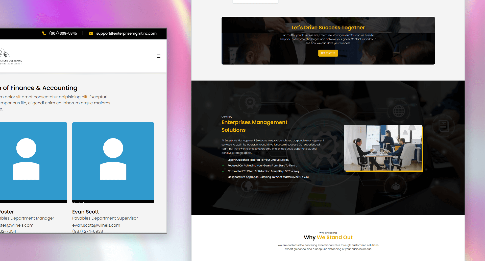
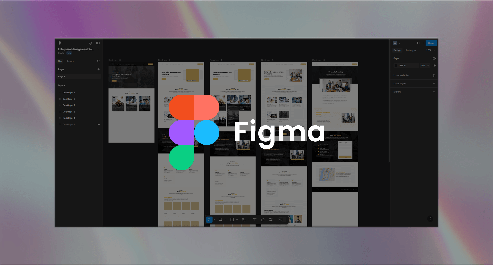

# Enterprise Management Solutions – Website Revamp

## 📌 Overview

This project is a complete redesign and restructuring project for the original Enterprise Management Solutions website. The goal was to modernize the look and feel, enhance the user experience, and build a responsive and accessible interface that adapts seamlessly across devices.

🔗 **Project demo:** <a href="https://enterprise-management-solutions.vercel.app/" target="_blank">https://enterprise-management-solutions.vercel.app/</a>

---

## ✨ Features

- ✅ Revamped UI/UX design
- 📱 Fully responsive layout for mobile and desktop
- 🧭 Improved content structure and flow
- ♿ Enhanced accessibility for all users
- ⚙️ Built with **Next.js** for optimized performance
- 🔍 SEO-ready setup

---

## 🛠️ Technologies Used

**Frontend & Design:**

- HTML
- CSS
- JavaScript
- Tailwind CSS
- Next.js

**Design Tools:**

- Figma
- Adobe Photoshop

---

## 🖼️ Screenshots

|  |  |
| :--------------------------------------------------: | :--------------------------------------------------: |
|  |  |
|  |  |

---

## 📁 Project Type

- 🎨 Design
- 💻 Development

---

## 📂 Tags

- `website-revamp`
- `UI/UX-design`
- `content-restructuring`
- `responsive-design`
- `modern-framework`

## 🙋‍♂️ About the Developer

Hi! I’m **Wilhelmus**, a Full Stack Web Developer and Web Designer passionate about building impactful digital experiences.

- <a href="https://wilhelmus.vercel.app/?ref=github_emc" target="_blank">Portfolio</a>
- <a href="https://www.linkedin.com/in/wilhelmusolejr/" target="_blank">LinkedIn</a>

---
